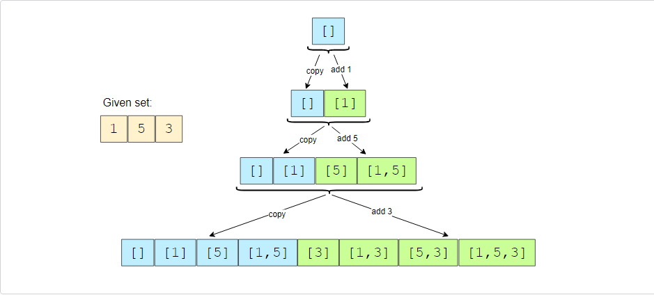

# GrokkingCodeInterview
Contact: Xiaoyang.rebecca.li@gmail.com

Educative.io/Grokking the Coding Interview: Patterns for Coding Questions
Corresponding of GrokkingCodeInterview to Leetcode

## Pattern: Sliding Window
* [Maximum Sum Subarray of Size K (easy)](./Patterns/Pattern-Sliding%20Window/Maximum%20Sum%20Subarray%20of%20Size%20K%20(easy).py)
* [Smallest Subarray with a given sum (easy)](./Patterns/Pattern-Sliding%20Window/Smallest%20Subarray%20with%20a%20given%20sum%20(easy).py)
* [Longest Substring with K Distinct Characters (medium)](./Patterns/Pattern-Sliding%20Window/Longest%20Substring%20with%20K%20Distinct%20Characters%20(medium).py)


## Pattern: Two Pointers

## Pattern: Merge Intervals
```
   ## Time O(N*logN)  (   O(N*logN) for sorting +O(N) for merging )


```
* [Merge Intervals (medium)](./Patterns/Pattern-Merge%20Intervals/Merge%20Intervals%20(medium).py)
  


## Pattern: Tree Breadth First Search

```
  ## Space O(w), where ‘W’ is the maximum number of nodes on any level.

  ls =[root]                            # queue: storage the node  in breadth first order
  while len(ls) > 0:
    level_width = len(ls)              # the width of the current level
    for i in range(level_width):
      n = ls.pop(0)         # pop
      ls.append( n.left )           # push left
      ls.append( n.right )          # push right
    
    ** Breath level caluclation

```
* [Binary Tree Level Order Traversal (easy)](./Patterns/Pattern-Tree%20Breadth%20First%20Search/Binary%20Tree%20Level%20Order%20Traversal%20(easy).py)
* [Reverse Level Order Traversal (easy)](./Patterns/Pattern-Tree%20Breadth%20First%20Search/Reverse%20Level%20Order%20Traversal%20(easy).py)
* [Zigzag Traversal (medium)](./Patterns/Pattern-Tree%20Breadth%20First%20Search/Zigzag%20Traversal%20(medium).py)
  - [Leetcode 103. Binary Tree Zigzag Level Order Traversal](./Leetcode/103.%20Binary%20Tree%20Zigzag%20Level%20Order%20Traversal.py)
  - [Leetcode 281. Zigzag Iterator](./Leetcode/281.%20Zigzag%20Iterator.py)
* [Level Averages in a Binary Tree (easy)](./Patterns/Pattern-Tree%20Breadth%20First%20Search/Level%20Averages%20in%20a%20Binary%20Tree%20(easy).py)  
  - [Leetcode 637. Average of Levels in Binary Tree](./Leetcode/637.%20Average%20of%20Levels%20in%20Binary%20Tree.py)
  - [Leetcode 1161. Maximum Level Sum of a Binary Tree](./Leetcode/1161.%20Maximum%20Level%20Sum%20of%20a%20Binary%20Tree.py)
* [Minimum Depth of a Binary Tree (easy)](./Patterns/Pattern-Tree%20Breadth%20First%20Search/Minimum%20Depth%20of%20a%20Binary%20Tree%20(easy).py)
* [Level Order Successor (easy)](./Patterns/Pattern-Tree%20Breadth%20First%20Search/Level%20Order%20Successor%20(easy).py)
* [Connect Level Order Siblings (medium)](./Patterns/Pattern-Tree%20Breadth%20First%20Search/Connect%20Level%20Order%20Siblings%20(medium).py)


  
## Pattern: Tree Depth First Search
* [Binary Tree Path Sum (easy)](./Patterns/Pattern-Tree%20Depth%20First%20Search/Binary%20Tree%20Path%20Sum%20(easy).py)

## Patter: Subset
```
   ## Time O(2^N)  Space O (^N)

```

* [Subset](./Patterns/Pattern-Subsets/Subset.py)
  - [Leetcode 78. Subsets](./Leetcode/78.%20Subsets.py)